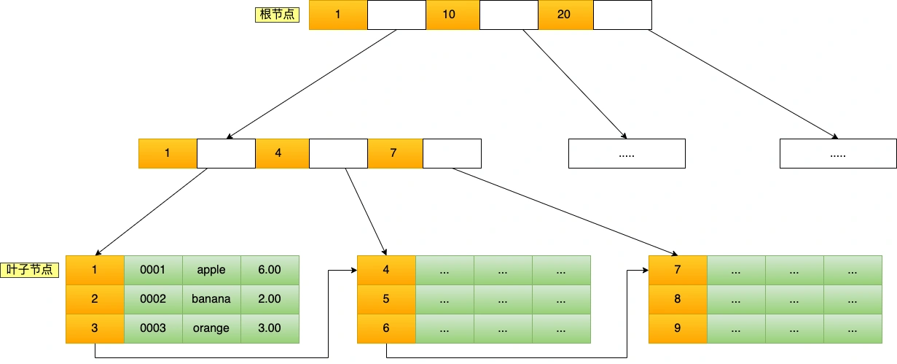

* 索引底层使用了什么数据结构和算法？
* 为什么 MySQL InnoDB 选择 B+tree 作为索引的数据结构？
* 什么时候适用索引？
* 什么时候不需要创建索引？
* 什么情况下索引会失效？
* 有什么优化索引的方法？

### 存储引擎
* 为数据建立存储、索引、更新、查询数据等技术的实现方法MyISAM 、InnoDB、Memory
  
### 索引分类
  * 按「数据结构」分类：B+tree索引、Hash索引、Full-text索引。
  * 按「物理存储」分类：聚簇索引（主键索引）、二级索引（辅助索引）。
  * 按「字段特性」分类：主键索引、唯一索引、普通索引、前缀索引。
  * 按「字段个数」分类：单列索引、联合索引。
  
### B+ Tree
 创建的主键索引和二级索引默认使用的是 B+Tree 索引


```diff
+ this will be highlighted in green
- this will be highlighted in red
```


-  `#f03c15`
-  `#c5f015`
-  `#1589F0`
