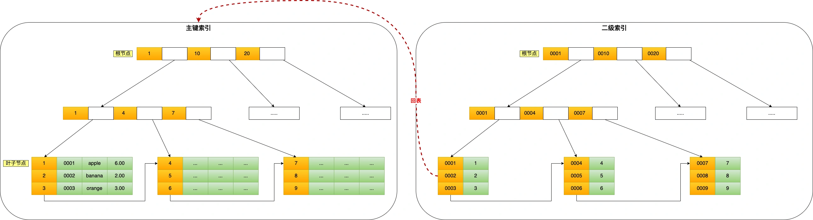

# 2.1索引的常见问题
* 索引底层使用了什么数据结构和算法？
* 为什么 MySQL InnoDB 选择 B+tree 作为索引的数据结构？
* 什么时候适用索引？
* 什么时候不需要创建索引？
* 什么情况下索引会失效？
* 有什么优化索引的方法？

### 存储引擎
* 为数据建立存储、索引、更新、查询数据等技术的实现方法MyISAM 、InnoDB、Memory
  
### 索引分类
  * 按「数据结构」分类：B+tree索引、Hash索引、Full-text索引。
  * 按「物理存储」分类：聚簇索引（主键索引）、二级索引（辅助索引）。
  * 按「字段特性」分类：主键索引、唯一索引、普通索引、前缀索引。
  * 按「字段个数」分类：单列索引、联合索引。
  
### B+ Tree建立索引查找
 创建的主键索引和二级索引默认使用的是 B+Tree 索引
* 使用主键索引来查询

  * B+ Tree树只有叶子节点才存放数据，其他节点只存放索引，每个节点里的数据是按照*主键顺序*存放的。每一个叶子节点中，包含了所有的索引值信息，每一个叶子节点都指向下一个叶子节点，形成链表。

* 使用二级索引来查询

  * 二级索引采用的存储方式也是B+ Tree，叶子节点里面存放的是索引值和主键值
  * 二级索引查询，根据查询的索引值，在叶子节点中找到主键值，*回表*，通过二级索引查询到的主键信息，返回到主键索引查询对应叶子节点的完整数据记录。
  
  * 如果在二级索引的叶子节点中可以查询到数据，则就不再需要回表，这个过程叫做*索引覆盖*。

### 为什么要用B+ Tree
* B+ Tree只有叶子节点存放了数据，非叶子节点就会比较小，在相同的IO磁盘访问下，B+ Tree可以访问更多的节点。
* B+ Tree只有叶子节点存放了数据，并且构成双向链表，适合全表扫面，顺序查找，这个是B Tree无法做到的。
* B+ Tree相比AVL Tree，B+ Tree矮而胖，在索引查找的时候，可以减少IO对磁盘的访问次数，加快查询。
* B+ Tree相比Hash，Hash做等值查询的时间复杂度是O(1)，但是不适合做范围查询。

### 按物理存储分类
从物理存储的角度来看，索引分为聚簇索引（主键索引）、二级索引（辅助索引）
* 主键索引的 B+Tree 的叶子节点存放的是实际数据，所有完整的用户记录都存放在主键索引的 B+Tree 的叶子节点里；
* 二级索引的 B+Tree 的叶子节点存放的是主键值，而不是实际数据。

### 按照字段特性分类
从字段特性的角度来看，索引分为主键索引、唯一索引、普通索引、前缀索引。
* 主键索引 
  主键索引就是建立在主键字段上的索引，通常在创建表的时候一起创建，一张表最多只有一个主键索引，索引列的值不允许有空值。
* 唯一索引 
  唯一索引建立在 UNIQUE 字段上的索引，一张表可以有多个唯一索引，索引列的值必须唯一，但是允许有空值。
* 普通索引 
  普通索引就是建立在普通字段上的索引，既不要求字段为主键，也不要求字段为 UNIQUE。
* 前缀索引 

### 按字段个数分类
从字段个数的角度来看，索引分为单列索引、联合索引（复合索引）。

* 建立在单列上的索引称为单列索引，比如主键索引；
* 建立在多列上的索引称为联合索引，联合索引是最左全局有序，依次局部有序
  * 联合索引按照最左匹配原则，也就是按照最左优先的方式进行索引匹配。
  * 当联合索引前面的字段用到了（>, <, between, like）这些语句，右边的索引就会失效，可以使用索引下推来解决。
  
### 什么时候需要/不需要使用索引
* 索引的优点
  * 提高查询速度 
* 索引的缺点
  * 创建索引需要消耗物理空间
  * 创建和维护索引都比较费时间
  * 会降低增删改的效率，每次增上该都会动态的维护索引
* 什么时候适合索引
  * 字段有唯一性的限制
  * 经常有where字段的查询条件
  * 经常用于group by或者order by的字段，这样查询的时候就需要做排序了，索引中已经做了排序 
* 什么时候不需要创建索引
  * WHERE 条件，GROUP BY，ORDER BY 里用不到的字段，索引的价值是快速定位，如果起不到定位的字段通常是不需要创建索引的，因为索引是会占用物理空间的。
  * 字段中存在大量的重复数据
  * 经常更新的字段，会增加维护成本
  
### 有什么优化索引的方法
* 前缀索引优化
  * 使用字段中前几个字符建立索引，减少索引的存储空间
* 覆盖索引优化
  * 从二级查询中得到查询的记录，可以比较回表的操作
* 主键索引最好是自增的
  * 在插入新的数据的时候，主键是自增的，只需要将新的记录插在最后面即可，不需要重新移动数据
* 防止索引失效
  * 使用like %xx或者like %xx%就会导致索引失效
  * 对需要查询的索引列做了计算、函数等操作会导致索引失效
  * 索引查询的时候要遵循最左匹配原则，否则索引会失效
  * 索引查询使用了OR，且后面不是索引列，会导致索引失效

* 常见扫描类型的执行效率从低到高的顺序
  * All（全表扫描）；
  * index（全索引扫描）；
  * range（索引范围扫描）；
  * ref（非唯一索引扫描）；
  * eq_ref（唯一索引扫描）；
  * const（结果只有一条的主键或唯一索引扫描）

### 总结
  

# 2.2InnoDB存储数据
InnoDB是按照数据也来存储数据的，当需要读取某一条数据的时候，将这一整页读取到内存中，InnoDB默认的数据也大小为16KB

* 数据页包含以下几个内容
* 
* 
* 
* InnoDB 里的 B+ 树中的每个节点都是一个数据页，结构示意图如下：
* 

* 6 种会发生索引失效的情况：
  * 当我们使用左或者左右模糊匹配的时候，也就是 like %xx 或者 like %xx%这两种方式都会造成索引失效；
  * 当我们在查询条件中对索引列使用函数，就会导致索引失效。
  * 当我们在查询条件中对索引列进行表达式计算，也是无法走索引的。
  * MySQL 在遇到字符串和数字比较的时候，会自动把字符串转为数字，然后再进行比较。如果字符串是索引列，而条件语句中的输入参数是数字的话，那么索引列会发生隐式类型转换，由于隐式类型转换是通过 CAST 函数实现的，等同于对索引列使用了函数，所以就会导致索引失效。
  * 联合索引要能正确使用需要遵循最左匹配原则，也就是按照最左优先的方式进行索引的匹配，否则就会导致索引失效。
  * 在 WHERE 子句中，如果在 OR 前的条件列是索引列，而在 OR 后的条件列不是索引列，那么索引会失效。
* 全扫描二级索引（在二级索引中就可以查询到记录）和全表扫面（需要回表才可以查询到记录）
* count()函数
  * select count(name) from t_order; 统计表中name字段不为NULL的个数；
  * select count(1) from t_order; 统计表中记录不为NULL的个数，每读取一条记录，count++；
  * select count(id) from t_order; 有二级索引走二级索引扫描，没有的话循环遍历主键索引，读取每一条记录。判断id是否是NULL，如果不是，则count++；