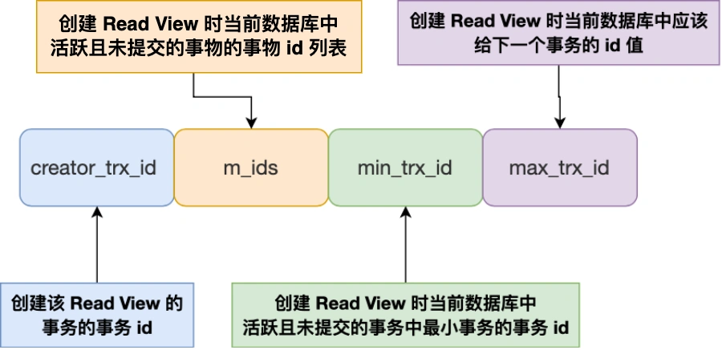

### 事务有哪些特性
* 事务的特性（ACID）
  * 原子性(Atomicity):一个事务的操作，要么全部完成，要么全部不完成。如果在中间发生错误，则会回滚到最初始的状态。
  * 一致性(Consistency):一个事务操作前和操作后，数据满足完整的约束性，数据库保持一致性状态。
  * 隔离性(Isolation):数据库允许有多个事务对其进行读写修改，隔离性防止多个事务交叉进行而导致的数据不一致。
  * 持久性(Durability):事务对数据库修改之后，数据应该是持久保持在数据库中的，不会丢失。
* 通过什么样的技术来保持这四个特性
  * 持久性：(redo log)重做日志来保证
  * 原子性：(undo log)回滚日志来保证
  * 隔离性：(MVCC)多版本并发控制和锁来保证
  * 一致性：通过持久性+原子性+隔离性来保证的

### 事务隔离
* 当多个事务并发读写数据库，就会出现脏读，不可重复读，幻读的现象
  * 脏读：事务A读取到了事务B修改但未提交的事务
  * 不可重复读：事务A开启事务之后，读取两次的数据不一样
  * 幻读：事务A开启之后读取数据的数量，两次不一样
* 四种隔离级别
  * 读未提交：事务A可以读取到其他事务未提交的变更
  * 读提交：一个事务的变更，只有他提交之后，才可以被其他事务读取到。（解决脏读）通过每次读的时候，都会生成read veiw，
  * 可重复读：一个事务开启之后，读取到的数据始终是一致的，InnoDB 存储引擎默认就是可重复读的隔离级别。（解决不可重复读）只有在生成事物的时候，才生成read view，后面的每一次读取都按照read veiw来读取。
  * 串行化：事务会对数据记录加上读写锁，只有当事务结束之后，其他事务才能够访问该数据，否则堵塞。（解决幻读）
* 串行化效率低，InnoDB是通过加Next-key lock锁（行锁+间隙锁），来避免幻读。
  
### Read View 在 MVCC(多版本并发控制) 里如何工作的

* 一个事务去访问记录的时候，除了自己的更新记录总是可见之外，还有这几种情况：
    * 如果记录的 trx_id 值小于 Read View 中的 min_trx_id 值，表示这个版本的记录是在创建 Read View 前已经提交的事务生成的，所以该版本的记录对当前事务可见。
    * 如果记录的 trx_id 值大于等于 Read View 中的 max_trx_id 值，表示这个版本的记录是在创建 Read View 后才启动的事务生成的，所以该版本的记录对当前事务不可见。
    * 如果记录的 trx_id 值在 Read View 的 min_trx_id 和 max_trx_id 之间，需要判断 trx_id 是否在 m_ids 列表中：
      * 如果记录的 trx_id 在 m_ids 列表中，表示生成该版本记录的活跃事务依然活跃着（还没提交事务），所以该版本的记录对当前事务不可见。
      * 如果记录的 trx_id 不在 m_ids列表中，表示生成该版本记录的活跃事务已经被提交，所以该版本的记录对当前事务可见。

### 解决幻读
通过next-key lock来解决幻读的问题，幻读的问题导致是由于除了普通查询都是快照读，其他的（例如 update， insert， delete）都是当前读，读取当前最新的数据。