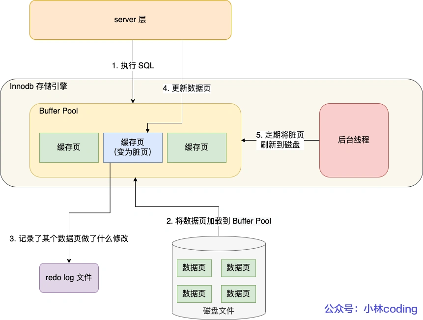

# MySQL日志

## 执行一条update语句
* UPDATE t_user SET name = 'xiaolin' WHERE id = 1;
* 过程：
  * 客户端连接服务端
  * 情况查询缓存
  * 解析器：构建语法树，词法分析，语法分析
  * 预处理器判断该字段是否存在
  * 优化器选择哪一个索引
  * 执行器执执行，找到相应的行，更新数据
* 以上会涉及到三个日志
  * 回滚日志（undo log）：InnoDB存储引擎生成的日志，实现事物的原子性，用于事务回滚和MVCC
  * 重做日志（redo log）：InnoDB存储引擎生成的日志，为了实现持久性，当掉电等故障，可以用于故障恢复
  * 归档日志（binlog）：server层生成的日志，用于数据备份和主从复制

****
### 为什么需要undo log
* 主要是为了保证**事务ACID特性中的原子性**
* 通过read view + undo log实现MVCC版本控制，顺着版本链找到合适记录

### 为什么需要redo log
* 在内存中增加了buffer pool缓存，CRUD操作，可以在缓存中执行。如果由于故障，内存中的数据掉电。InnoDB可以在适当的时候，后台线程将redo log中的脏页写到磁盘中。

* redo log 记录了此次事务**「完成后」的数据状态，记录的是更新之「后」**的值；
* undo log 记录了此次事务**「开始前」的数据状态，记录的是更新之「前」**的值；  
* 什么时候写redo log到磁盘
  * MySQL 正常关闭时；
  * 当 redo log buffer 中记录的写入量大于 redo log buffer 内存空间的一半时，会触发落盘；
  * InnoDB 的后台线程每隔 1 秒，将 redo log buffer 持久化到磁盘。
  * 每次事务提交时都将缓存在 redo log buffer 里的 redo log 直接持久化到磁盘
  
### 未什么需要binlog
* binlog 是记录对数据库所有更改的操作，不会记录查询的操作，比如select和show  
* 为什么有了 binlog， 还要有 redo log？
  * 最开始 MySQL 里并没有 InnoDB 引擎，MySQL 自带的引擎是 MyISAM，但是 MyISAM 没有 crash-safe 的能力，binlog 日志只能用于归档。
  * 而 InnoDB 是另一个公司以插件形式引入 MySQL 的，既然只依靠 binlog 是没有 crash-safe 能力的，所以 InnoDB 使用 redo log 来实现 crash-safe 能力。
* binlog 是 MySQL 的 Server 层实现的日志，所有存储引擎都可以使用；
* redo log 是 Innodb 存储引擎实现的日志；
* binlog 文件保存的是全量的日志，也就是保存了所有数据变更的情况，理论上只要记录在 binlog 上的数据，都可以恢复，所以如果不小心整个数据库的数据被删除了，得用 binlog 文件恢复数据。